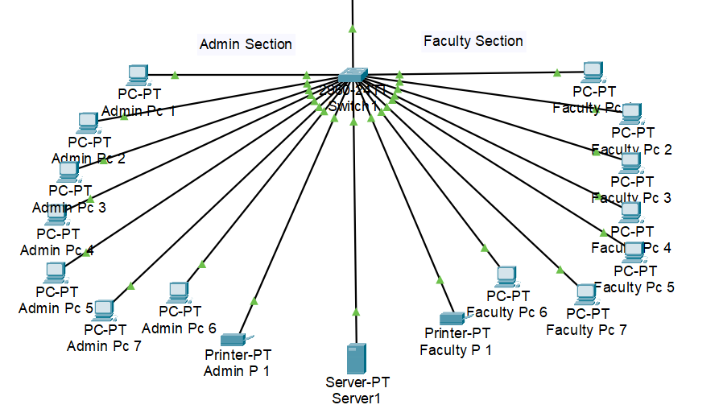
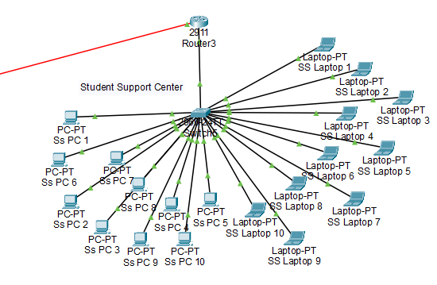
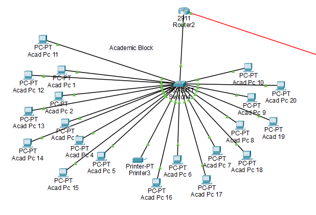
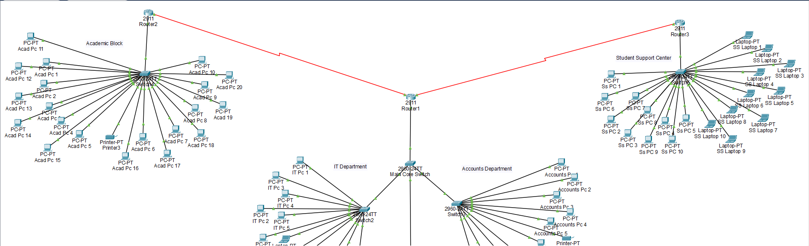

# CCN Campus Network Design Project

A comprehensive campus network design and simulation project developed using Cisco Packet Tracer.  
This project demonstrates real-world network planning, configuration, and testing for a multi-campus environment.

## Description

This project showcases the design and implementation of a campus network with multiple sub-campuses.  
It includes network topology creation, router and switch configuration, IP addressing, and connectivity testing.  
The project is suitable for students and professionals interested in **network design, Cisco Packet Tracer simulations, and practical networking concepts**.

## Features

- Multi-campus network design with hierarchical structure
- Router and switch configuration for inter-campus communication
- IP addressing and subnetting implementation
- Simulation of network traffic and connectivity
- Documentation of network topology and configurations
- Professional project report included in PDF format

## Technologies Used

- Cisco Packet Tracer
- Networking Protocols: RIP, OSPF, VLANs
- IP Addressing & Subnetting
- Windows/Linux (for running Packet Tracer)

## Project Files

- `Campus_Network.pkt` → Cisco Packet Tracer network file  
- `Campus_Network_Report.pdf` → Project report  
- `router-switch-config.txt` → Configuration commands for routers and switches  
- `screenshots/` → Folder containing network screenshots  

## Network Topology Screenshots

### Main Campus Topology

  

### Sub-Campus 1 Topology

  

### Sub-Campus 2 Topology

  

### Full Network Overview

  

## How to Run / Use

1. Clone or download the repository.  
2. Open `Campus_Network.pkt` in Cisco Packet Tracer.  
3. Review router and switch configurations using `router-switch-config.txt`.  
4. Simulate network traffic and test connectivity.  
5. Refer to `Campus_Network_Report.pdf` for project explanation and analysis.  

## Author
**Muzamil Rehman**  
